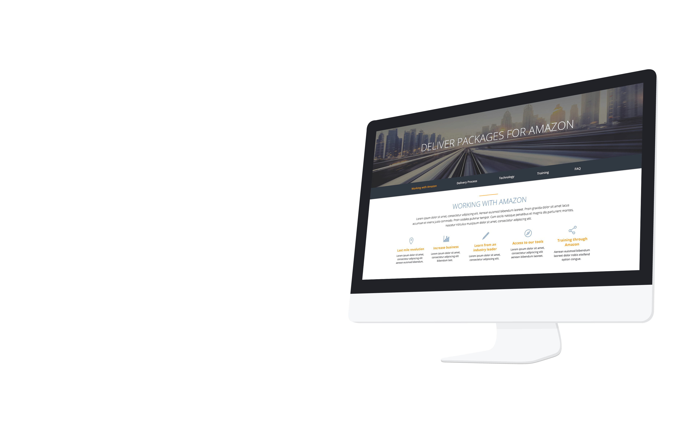
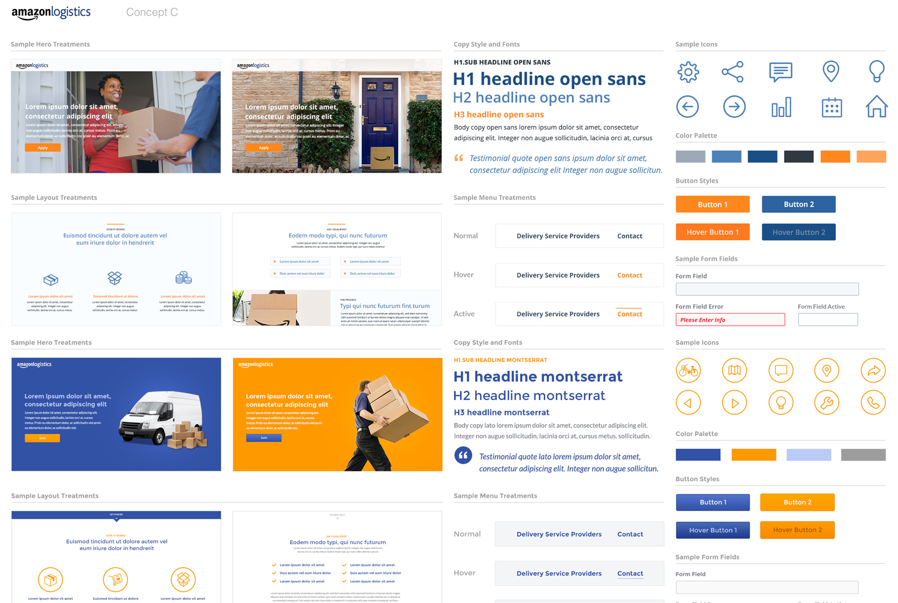
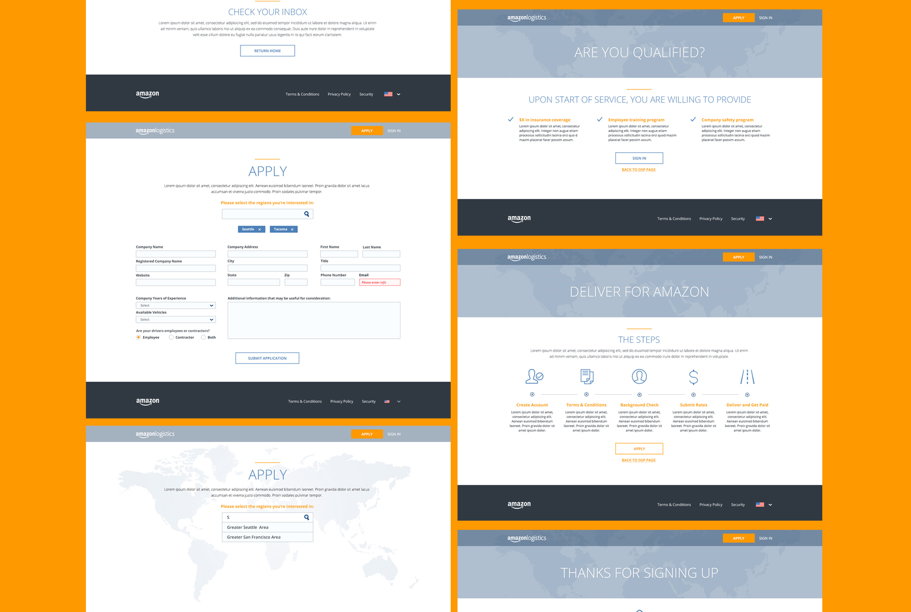
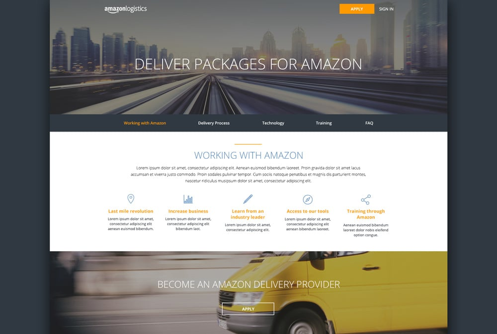
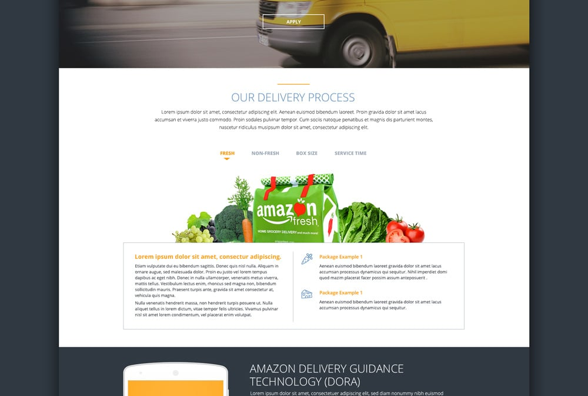
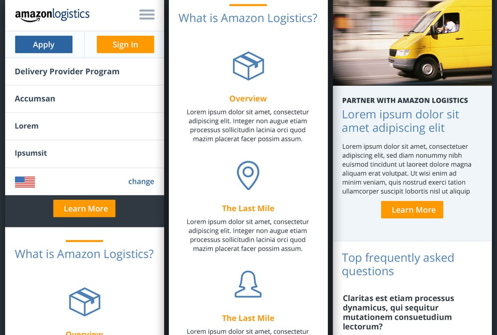

launch a new information and recruiting tool for Amazon to educate potential service providers and provide qualified leads.

### Project Goals

Attract and help qualify potential DSP's (delivery service providers ) and establish a unique, identifiable brand presence for Amazon and create a design and messaging framework that can scale for future program changes

### The Stakes

As part of the discovery phase, interviews were conducted with ten key members of the logistics team allowing us to gain a deeper understanding of how their business functioned. Interviewees were representatives from the U.S./U.K. teams encompassing product managers, designers and developers

#### Focus

Strategy, Information Architecture, Stakeholder interviews, Creative Direction, UX, UI

#### Services

Strategy, Design, Content, Development
