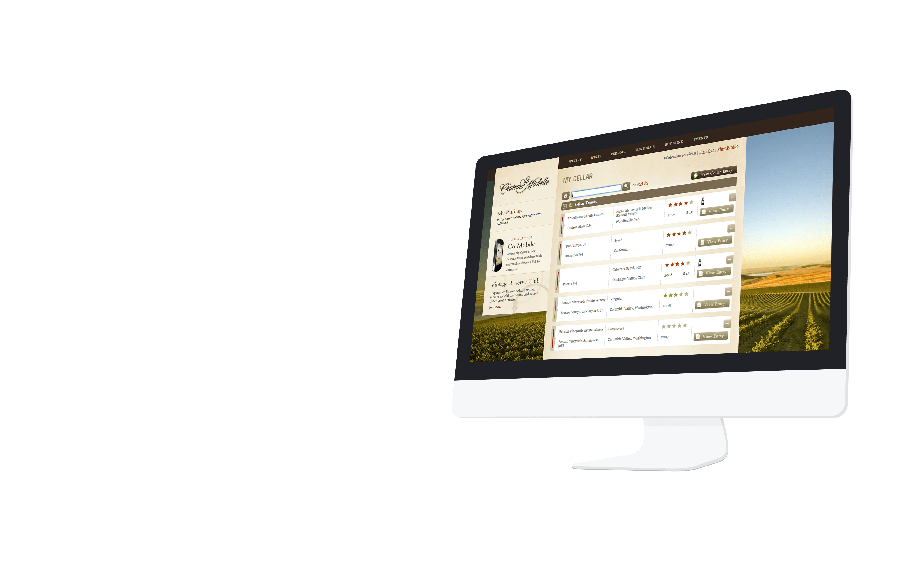
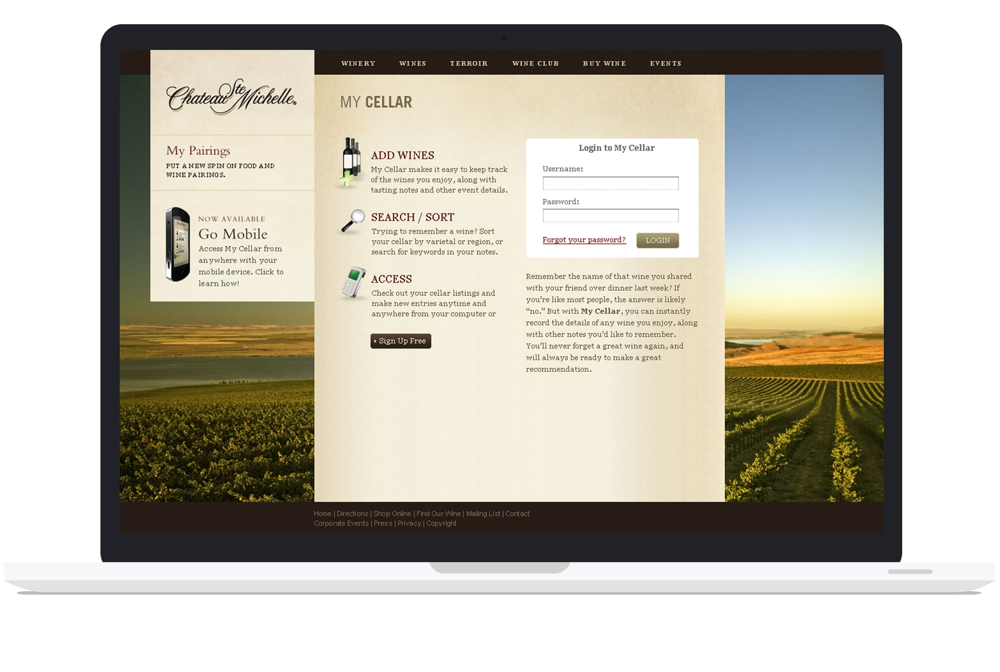
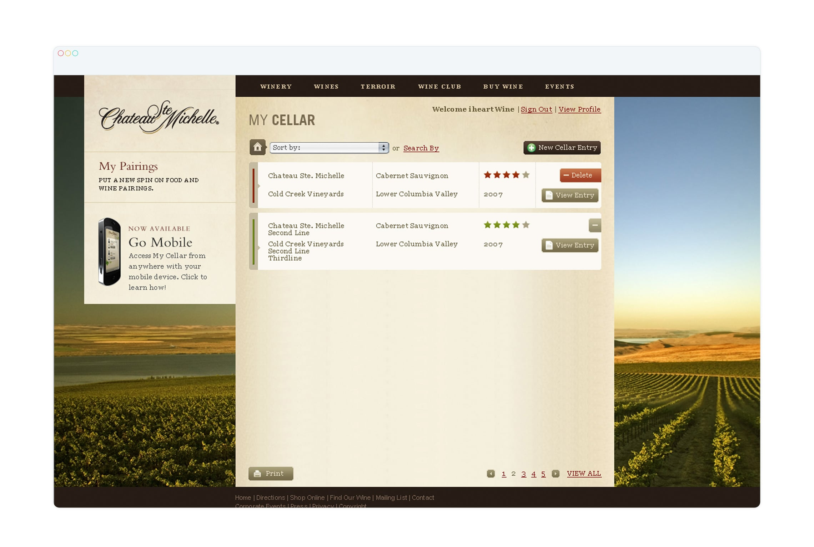
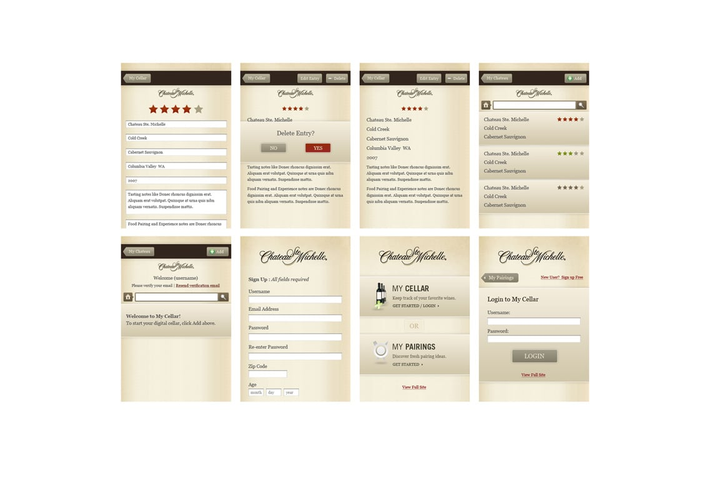
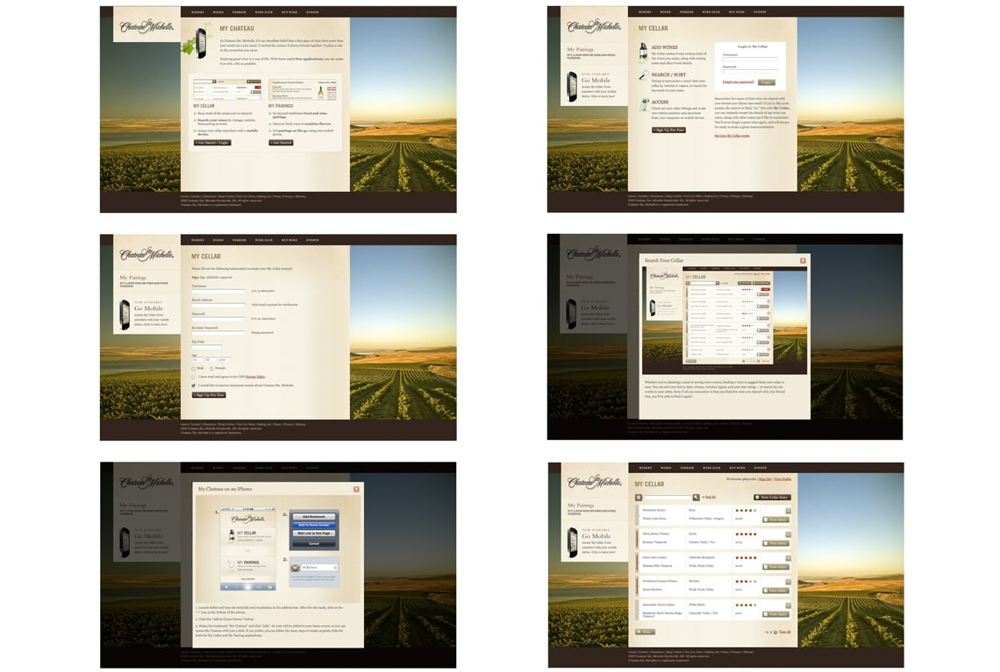
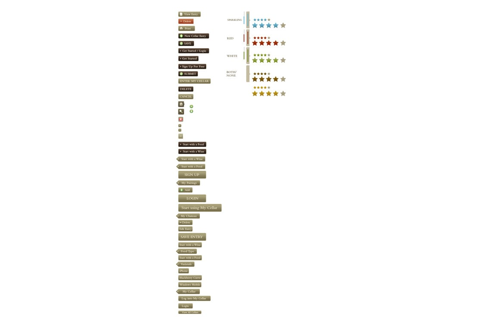

launch a new information and recruiting tool for Amazon to educate potential service providers and provide qualified leads.

### personalized data sets for each user

chart based data was made available to users helping them gain a better understanding of what was in their cellar
igners and developers

#### Focus

Project Oversight, UX/UI Strategy, Media Oversight, Prototyping, Mobile Strategy, Content Strategy

#### Services

Strategy, Design, Content Strategy, Technology, IxD
