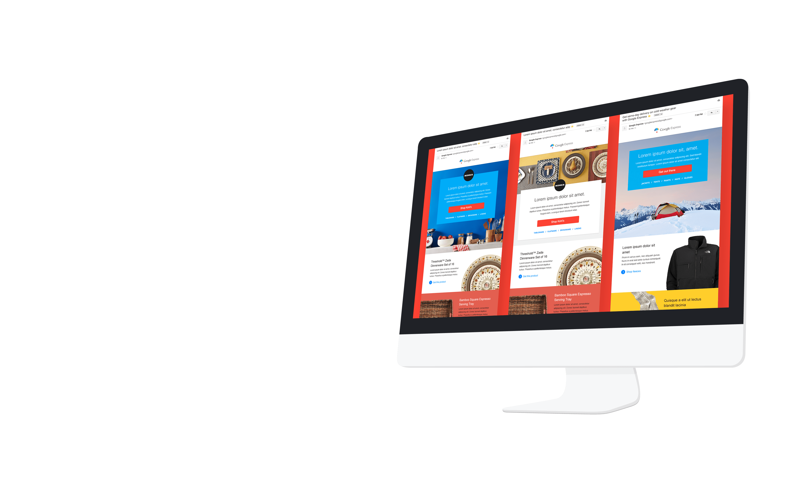
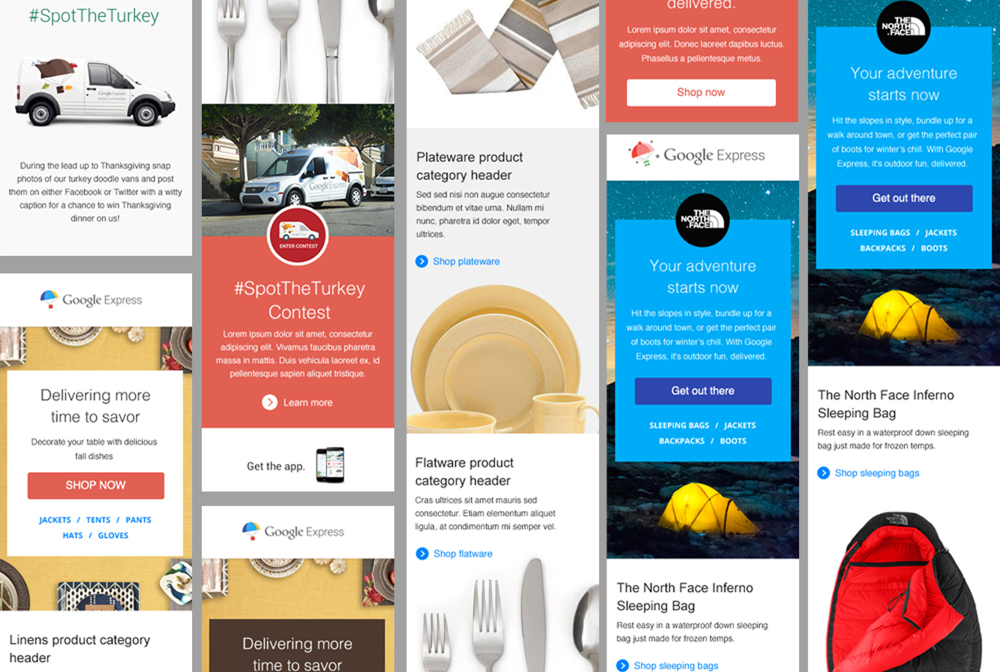
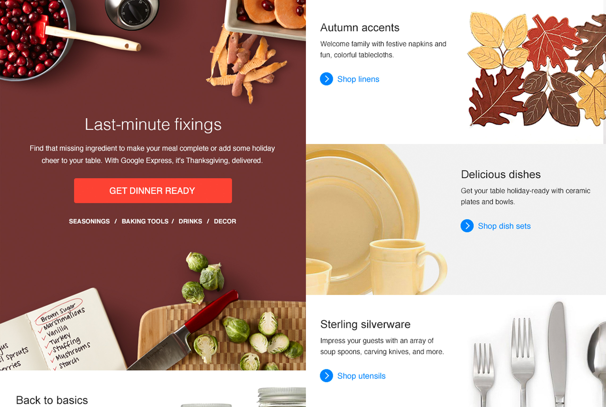
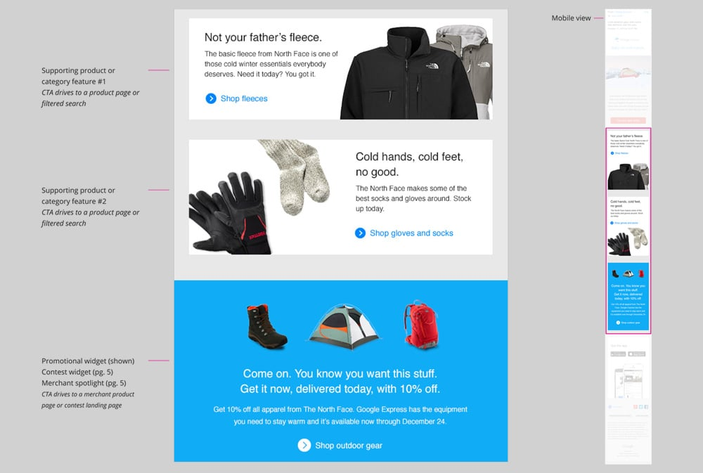
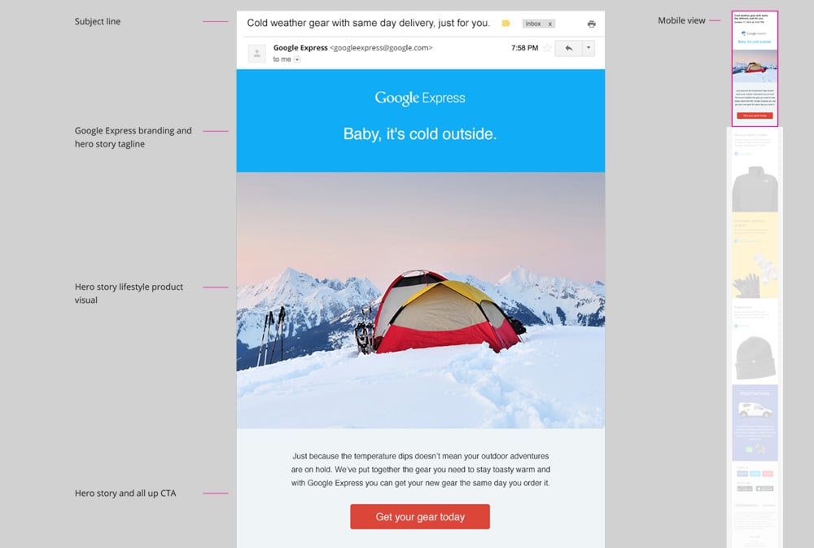

producing a series of reusable and dynamic email templates to help increase sales while reducing the overall number of communications sent by delivering relevant information to the consumer.

To assist the internal marketing team at Google to redesign a series of email templates that will increase the spend for existing customers while decreasing the number of email communications by delivering compelling, relevant and entertaining content and offers.

### My Approach

Start from the start. Eye-catching creative is great, but it’s only one part of the puzzle. A subject line is critical in email. If users don’t open the mail, we’ve lost an opportunity. Once we have our concept and creative, we need to deliver great content with clear and concise CTA’s. In email, we like to keep things short and sweet whenever possible. Deliver compelling content, and ask users to take the next step

### Power to the Email

As the lead for strategy, and presenter for the pitch team, it was my responsibility to oversee the deck and its content. We and provided a deep analysis of the existing email landscape from a UX, UI, content and technology lenses

#### Focus

- Strategy
- Design
- Content Strategy
- Technology

#### Services

- Business Dev
- Product Management
- Cost Estimates
- UX/UI Strategy
- Pitch Team
- Marketing Strategy
- Prototyping
- Mobile Strategy
- Content Strategy