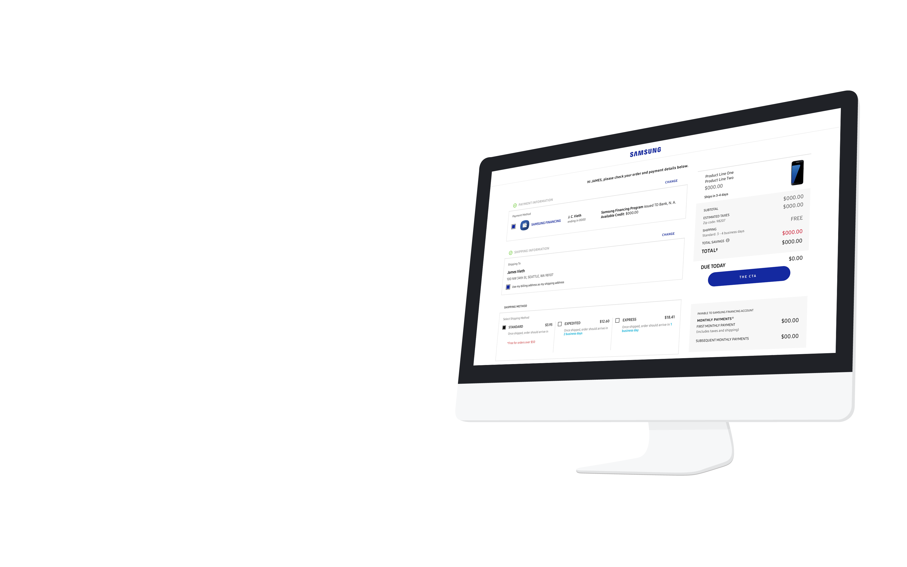
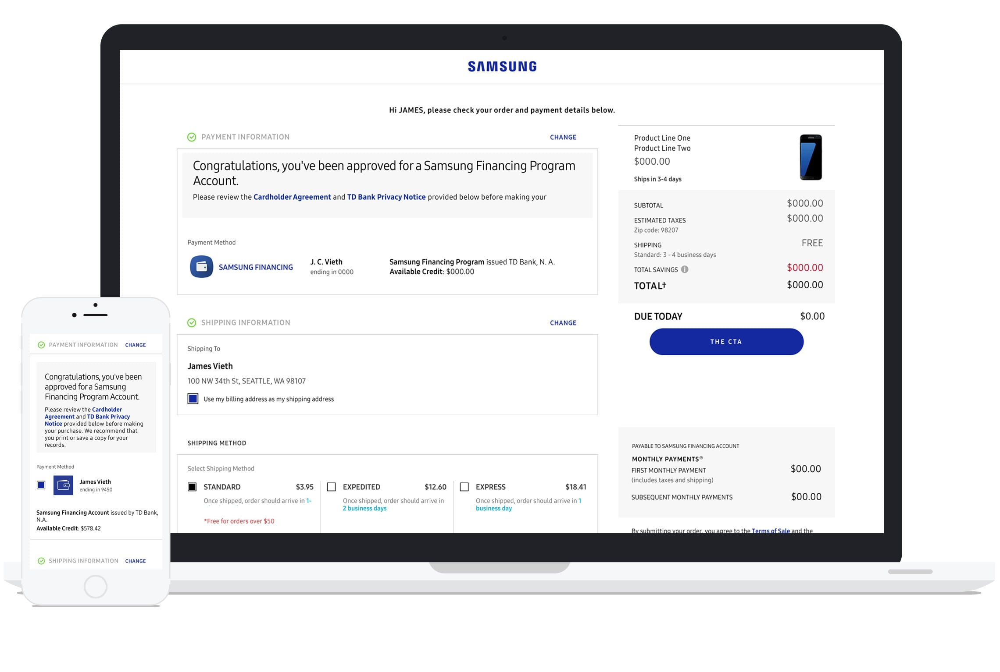
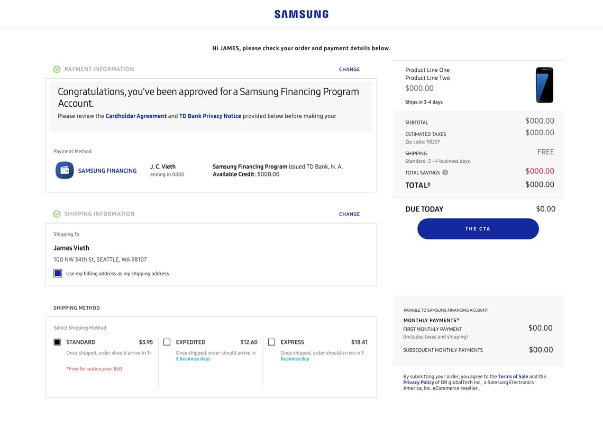
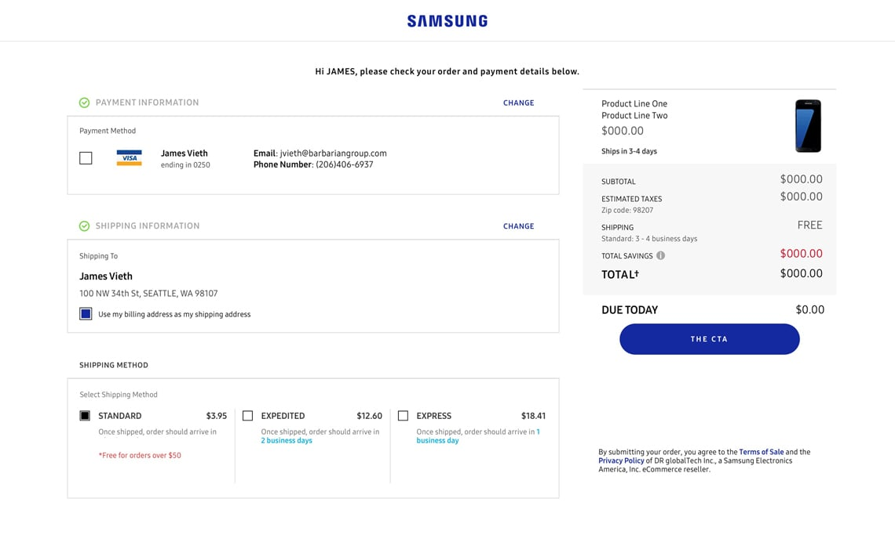
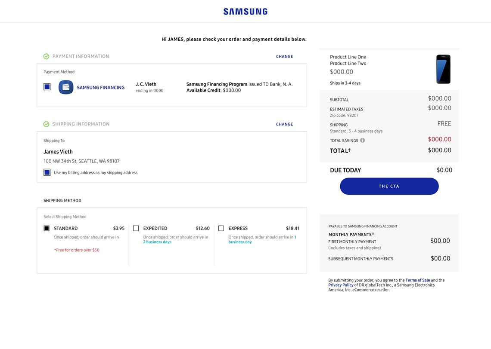
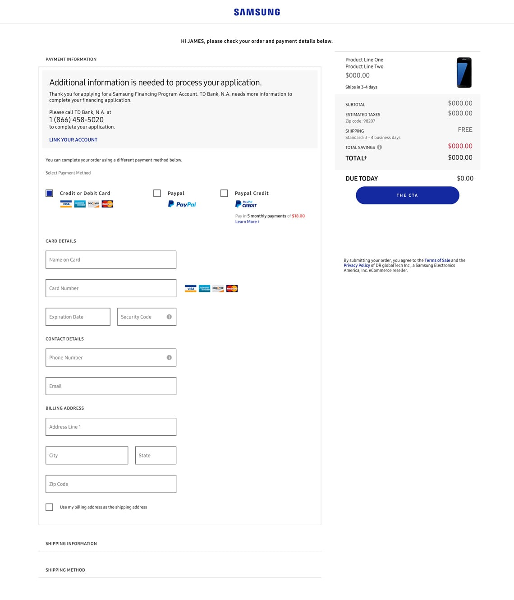
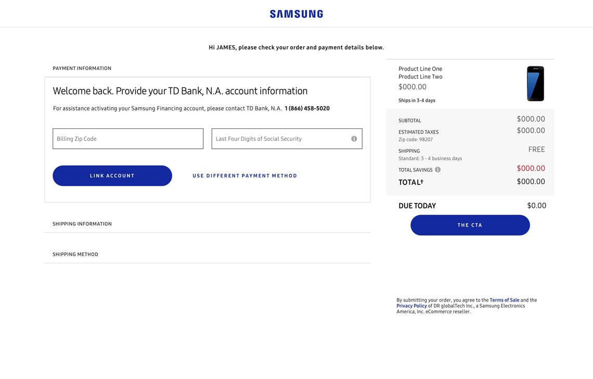
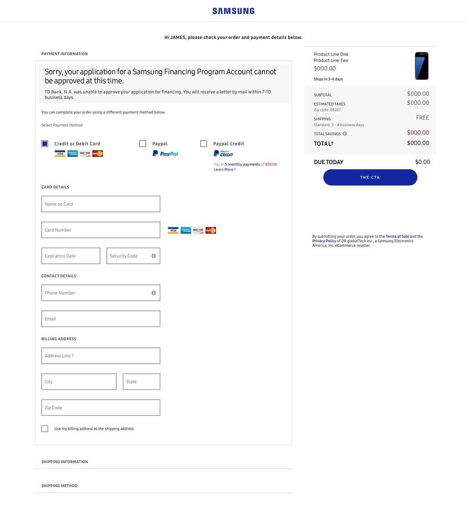
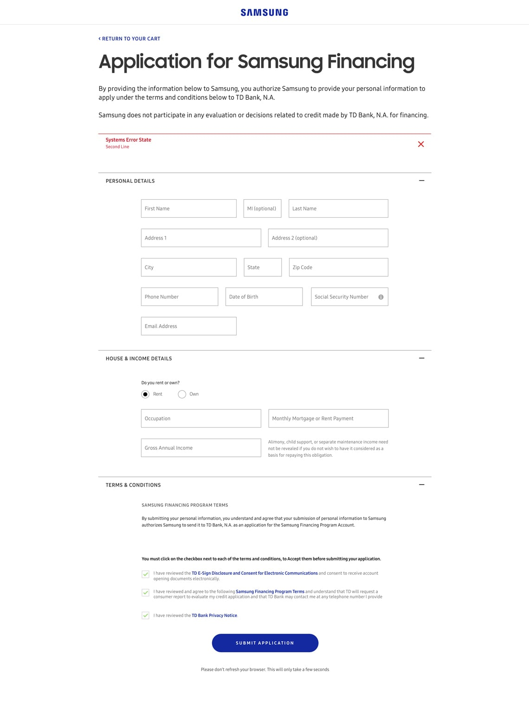

Reimagining the Samsung cart and checkout experience to create patterns flexible enough to allow to quickly integrate the ever changing requirements of an enterprise level commerce site.

## Focus

- Creative Oversight
- User Experience Strategy
- Customer Experience Strategy

## Services

- Creative Direction
- Team Lead
- Team Management
- User Experience Strategy 
- Interaction Design

