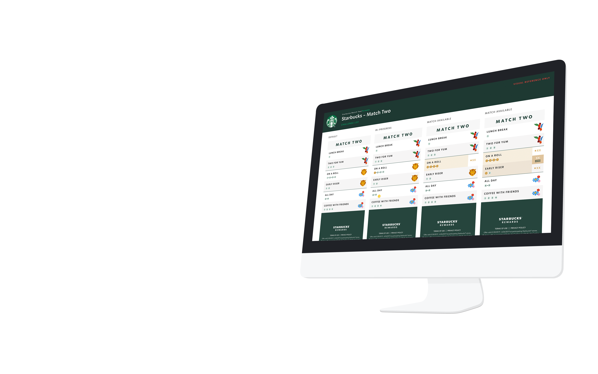
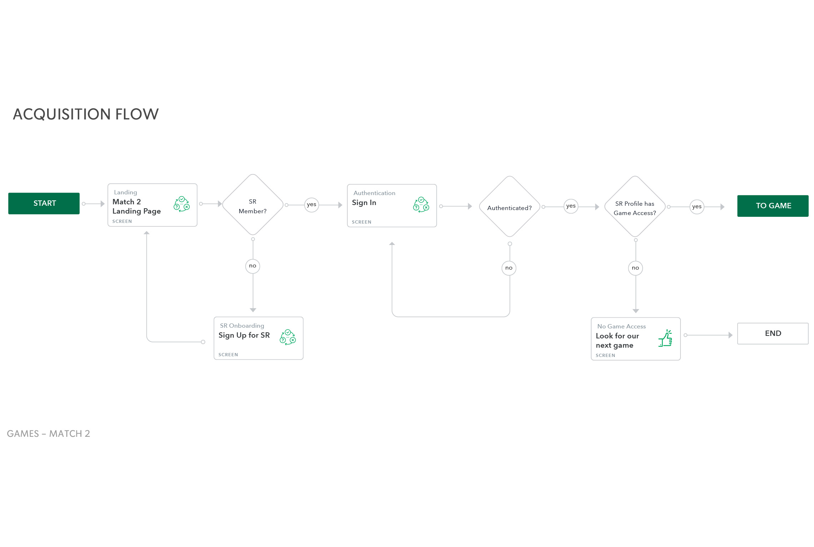
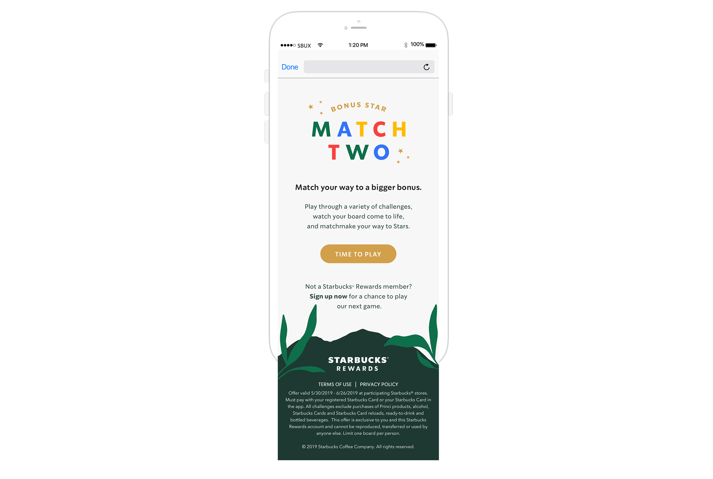
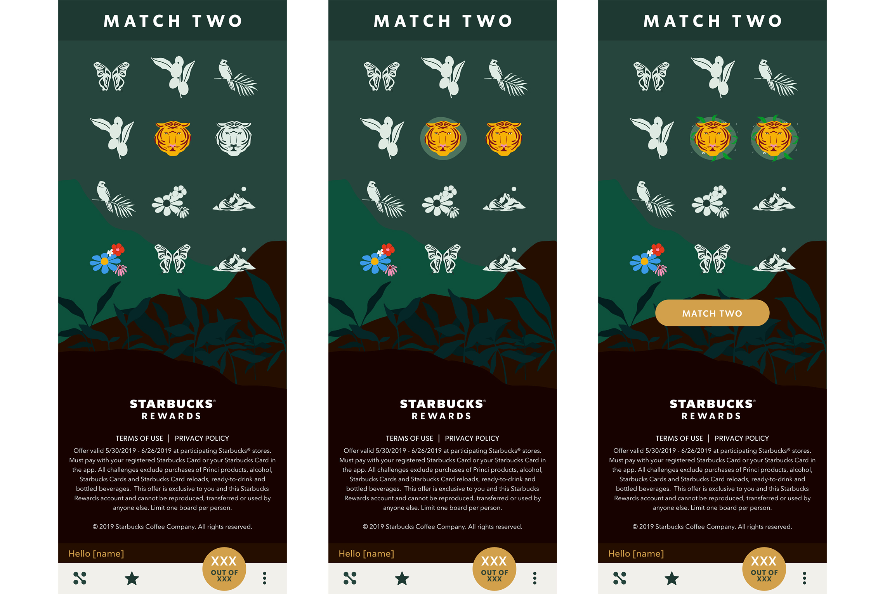
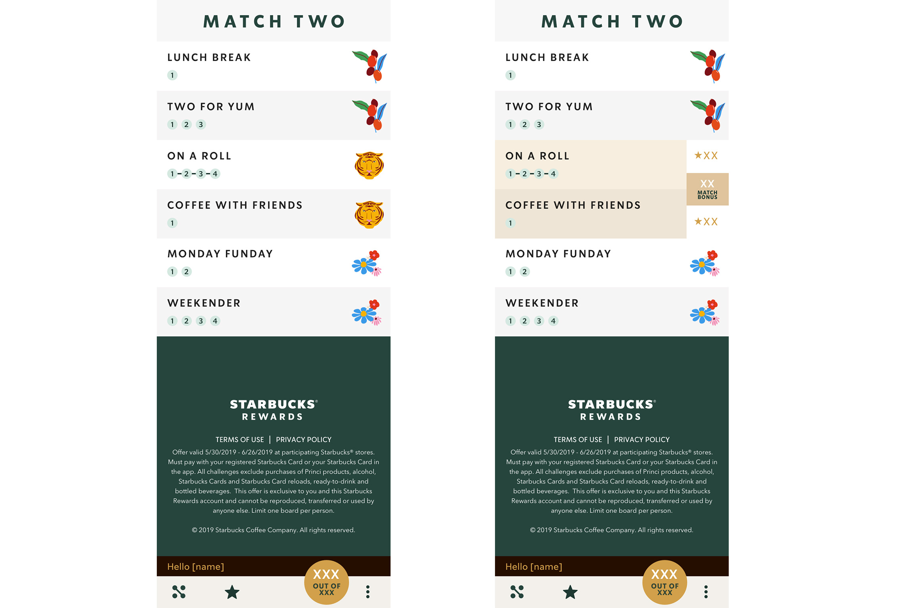
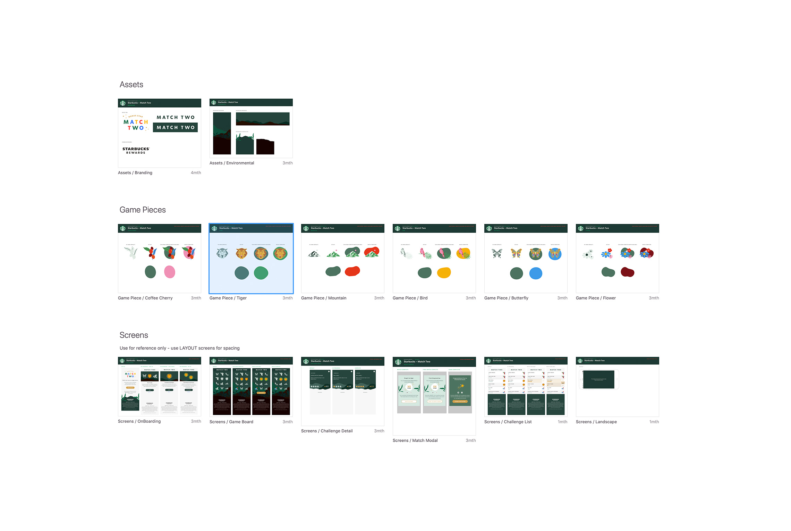
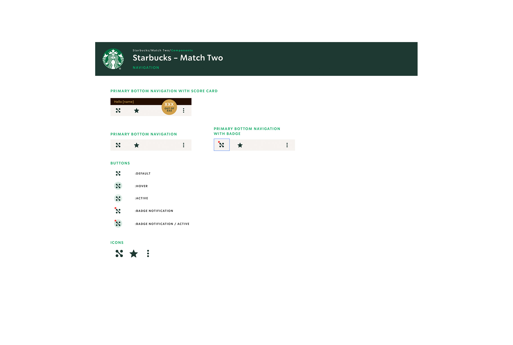
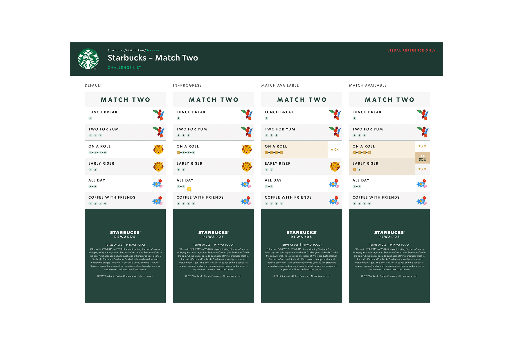

Partnered with Starbucks Creative Studio to create and implament design system for their seasonal games with the goal of providing a better user experience while reducing creative and development timelines and budget

### The Creative Team

Creative Direction: Andrea Hillard Art Direction: Trevor Basset Design Lead and Animator: Abby McCartin

### Focus

- UX Strategy
- UI Production
- Prototyping
- Pattern Libraries
- Sketch Build
- Asset Management

## Services

- Strategy
- UX
- UI
- Design System
- Asset Management
- Strategic Project Oversight
