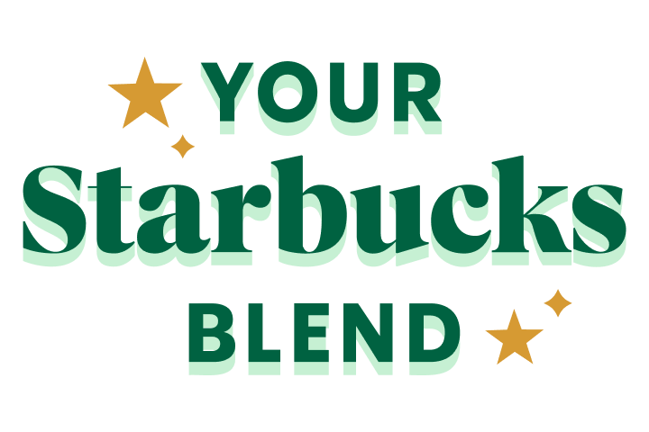
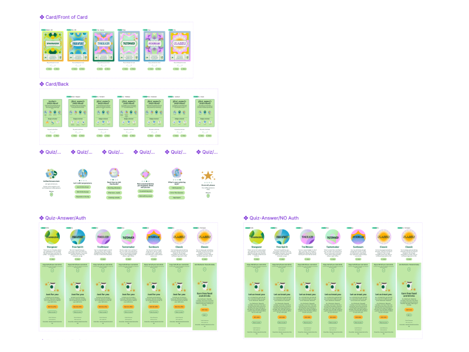
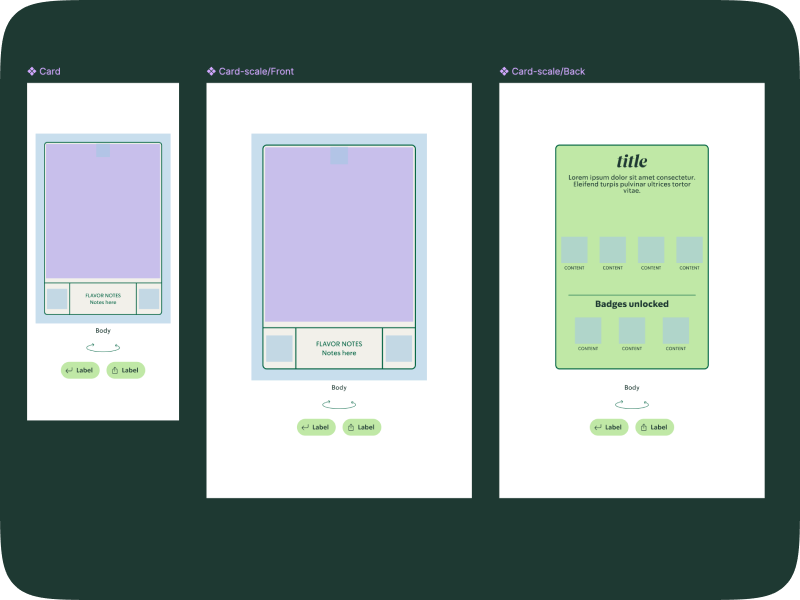
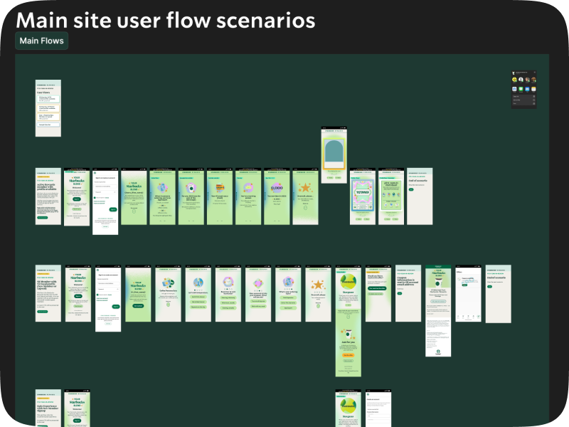

## Your coffee routine says a lot about you. Not just what you like, but who you are.

- design strategy
- grey-box wire framing
- Figma-based design system creation and management
- multi language content matrix creation and management
- asset production
- design delivery
- a11y oversight
- quality assurance 

### Robust Design System based in Figma

Created a design system using Figma to allow for quick iteration of designs and content more consistency and efficiency

\
\

